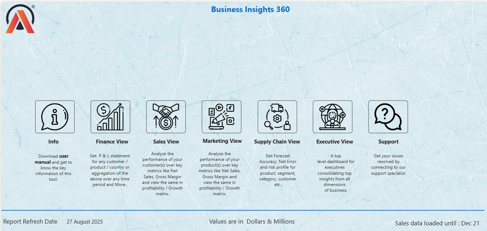
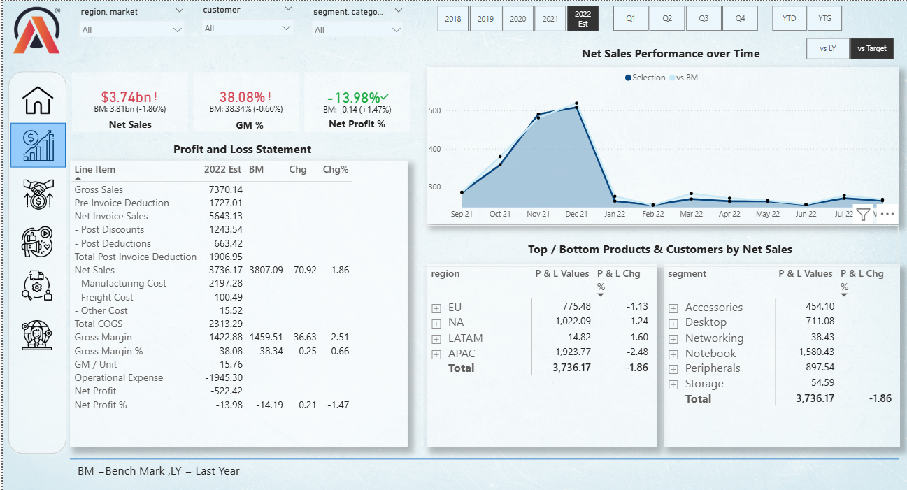
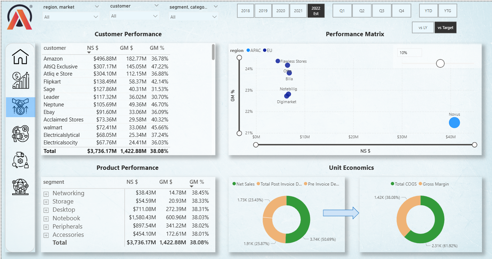
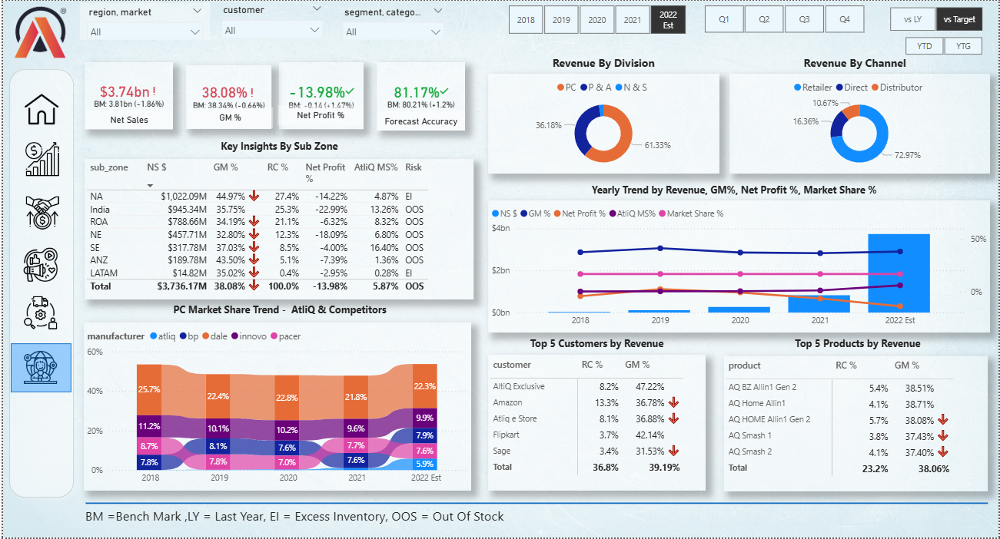
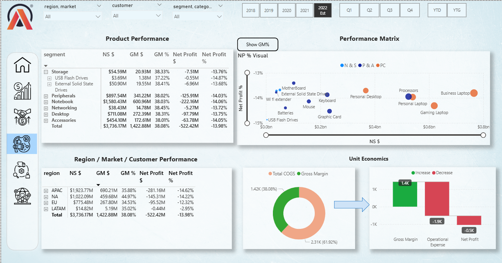
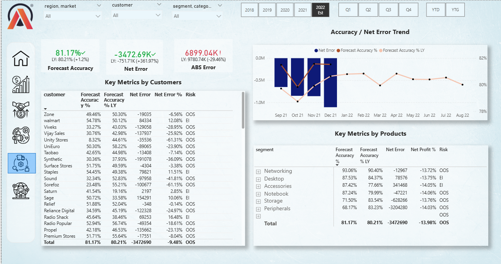

## Business Insights 360: Power BI Dashboard Project
Empowering Businesses with Effective Insights

🔍 Project Overview

This project focuses on creating an interactive Power BI dashboard to analyze key business metrics and provide actionable insights for strategic decision-making. It showcases advanced data visualization techniques to evaluate performance and unlock growth opportunities.

✨ Key Features

Customer Performance Analysis: Evaluate customer performance against sales targets. Market Performance Insights: Understand market trends and expansion opportunities. Actionable Recommendations: Optimize sales strategies to maximize revenue and customer satisfaction. Dynamic Visuals: Interactive charts and graphs for data exploration.

🎯 Objective

The goal of this project is to empower businesses with tools to monitor, evaluate, and improve their sales activities by providing actionable insights that drive growth and maintain competitiveness.

📊 Tools & Technologies Used

🖼️ Screenshots

Dashboard Overview

#### Finance View

#### Sales View

#### Executive View

#### Marketing View

#### Supply Chain View

Microsoft Power BI: For creating the dashboard and visualizing data. Excel: Used for data preparation and preprocessing. Skills: Pivot tables, Power Query, basic DAX, conditional formatting, and report beautification.
🖼️ Screenshots

🚀 How to Use This Project

Prerequisites:

Microsoft Power BI Desktop (Latest Version).

Steps to Explore:

Clone this repository to your local machine.

Open the Report.pbix file in Power BI Desktop. Interact with the dashboard to explore insights.

💡 Learning Outcomes

Developed advanced data visualization and storytelling skills. Gained insights into sales metrics and customer behavior. Enhanced proficiency in Power BI and Excel.

📈 Actionable Insights from the Project

Identify the most effective customer discounts to improve sales performance. Highlight markets with the highest potential for expansion. Negotiate with customers based on performance metrics.

🌟 Connect With Me

LinkedIn: https://www.linkedin.com/in/manoja-bandi

